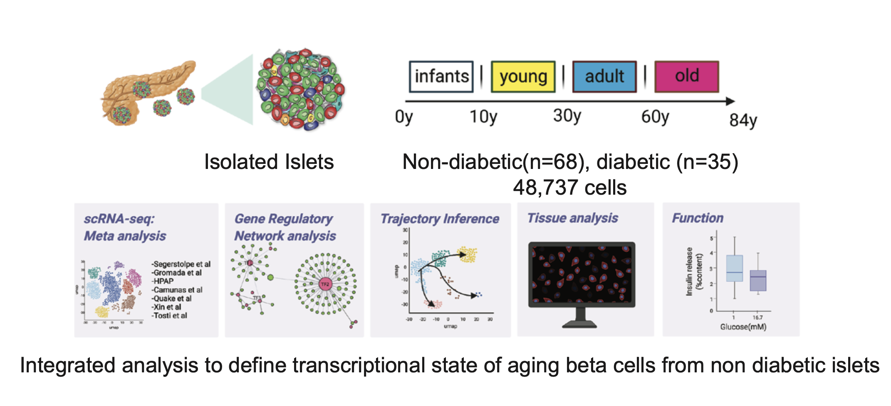

# Aging compromises human islet beta cell function and identity by decreasing transcription factor activity and inducing ER stress

Shristi Shrestha1 , Galina Erikson2, James Lyon4, Aliya F Spigelman4, Austin Bautista4, Jocelyn E Manning Fox4, Maxim Shokhirev2, Jean-Phillippe Cartailler1, Martin W. Hetzer3, Patrick E. MacDonald4, Rafael Arrojo e Drigo5.

1 – Creative Data Solutions, Vanderbilt Center for Stem Cell Biology, Nashville, Tennessee, USA. \
2 – Integrative Genomics and Bioinformatics Core, Salk Institute of Biological Studies, La Jolla, CA, USA 92037 \
3 – Molecular and Cell Biology Laboratory, Salk Institute of Biological Studies, La Jolla, CA, USA 92037 \
4 – Department of Pharmacology and Alberta Diabetes Institute, University of Alberta, Edmon- ton, Canada, T6G2E1 \
5 – Department of Molecular Physiology and Biophysics, Vanderbilt University, Nashville, Ten- nessee, USA. \

## Repository contains scripts and links to analysis data used to generate manuscript figures

## Data:

* **Data source** : Raw files of data analyzed in this manuscript were retrieved from following data deposits:
  
  1. GEO accession number GSE81547(Enge et al 2017), 
  2. GEO accession number GSE81608 (Xin et al 2016) 
  3. ArrayExpress accession E-MTAB-5061 (Segerstolpe et al 2016)
  4. GEO accession number GSE114297 (Xin et al 2018) 
  5. GEO accession number GSE124742 (Camunas et al 2020)
  6. European Genome-Phenome Archive EGAS00001004653 (Tosti et al 2020)
  7. https://hpap.pmacs.upenn.edu/ (Human Pancreas Analysis Program)

* **Analysis data access** : Seurat object containing annoted cell types, clusters, donor metadata, pySCENIC regulon binary matrix, pySCENIC auc scores and scRNA-seq gene expression are posted to zenodo.org (**link**)

  **Files**

  1. `panc.filtered.Rds` - Seurat object for post-processed, merged and integrated dataset
  2. `allcelltype_healthy_13000.pySCENIC` - Seurat object for subset of cells(randomized 13,000) from healthy donors only. Also contains pySCENIC generated binary matrix for regulons and auc scores as separate assays
  3. `beta_healthy4.h5ad` - Ann data object for beta cell subset from healthy donors only
  4. `beta_healthy2_BIN.h5ad` - Ann data object for beta cell subset from healthy donors only that includes pySCENIC binary matrix

  

## Scripts:

Script folder contain both R and python script organized by the figure numbers in the manuscript.

## Worksheets:

These are inputs used for some of manuscript figures. They were generated from multiple pySCENIC run on various agegroup and cell type subsets. See scripts for respective figure script documentation for details on these csv files.

worksheets are posted to zenodo.org (**link**)

